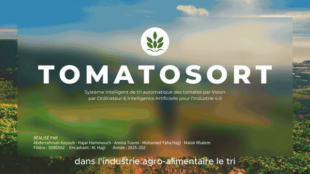
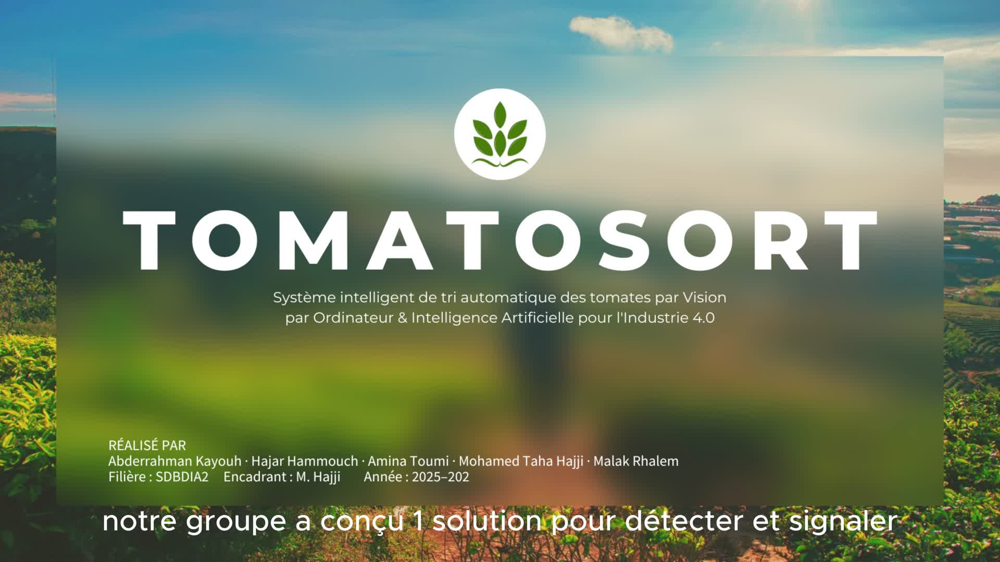
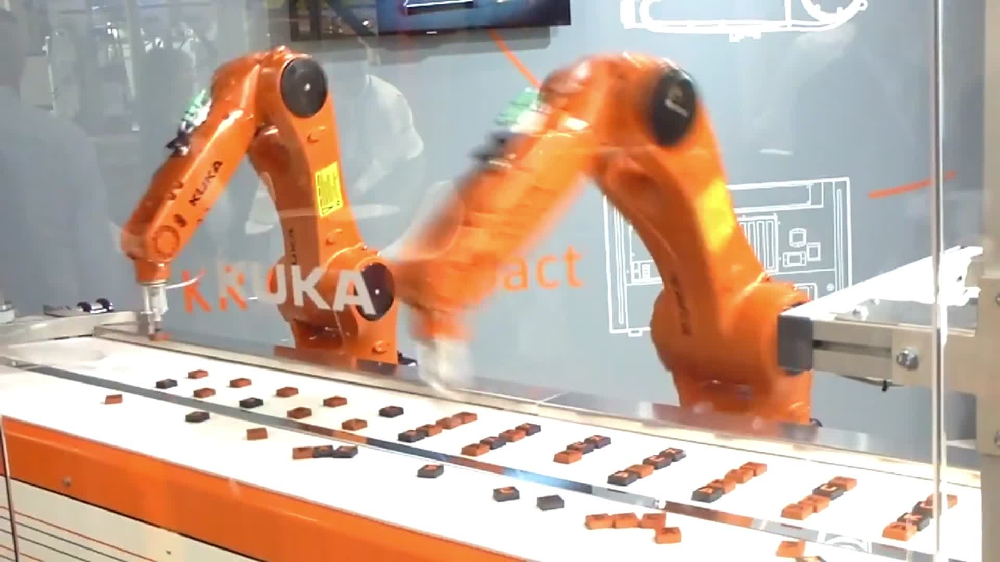

<div align="center">

# 🍅 TomatoSort Pro

### Real-time tomato & foreign-object detection with YOLOv8 + OpenVINO

*A computer-vision prototype that watches a live camera feed, flags healthy cherry tomatoes in green and foreign objects in red, and runs it all through an Intel-optimized model on a live dashboard.*

<br>


<br>

**mAP@50 `0.846` · Precision `0.92` · Recall `0.86` · F1 `0.90`**

</div>

---

## 🎬 Demo

<div align="center">



*Live walkthrough — the model detecting healthy tomatoes (green) and foreign objects (red) in real time.*

▶️ **[Watch the full 4K video](ADD_YOUR_VIDEO_LINK_HERE)** — *upload the original to YouTube / Google Drive / a GitHub Release and paste the link here (too large to store in the repo).*

</div>

| Live dashboard | Detection view |
|:---:|:---:|
|  |  |

---

## 📖 What it does

TomatoSort Pro is a real-time visual inspection prototype for a tomato sorting line. It:

- 🎥 reads a **live camera feed**,
- 🍅 detects **healthy cherry tomatoes** (drawn in green) using a trained **YOLOv8-nano** model,
- 🚨 flags **foreign objects / intruders** (drawn in red) using both the model and an **HSV dark-object mask**,
- ⚡ runs the model through **Intel OpenVINO** for fast CPU inference,
- 📊 streams counts, FPS, and alerts to a **Streamlit dashboard**.

There are two ways to run it: a **Streamlit web dashboard** (`app.py`) and a lightweight **OpenCV window** (`cam.py`).

> 🎓 Mini-project — *Vision industrielle / IA en milieu industriel*, ENSA Agadir, Filière SDBDIA2, 2025–2026. The accompanying [technical report](docs/) explores how this prototype would scale into a full Industry 4.0 pipeline (Big Data, MLOps, PLC control).

---

## 🚀 Getting Started

```bash
# 1. Clone
git clone https://github.com/AbderKay/tomatosort-pro.git
cd tomatosort-pro

# 2. Create a virtual environment
python -m venv .venv
source .venv/bin/activate        # Windows: .venv\Scripts\activate

# 3. Install dependencies
pip install -r requirements.txt
```

**Run the Streamlit dashboard:**
```bash
streamlit run app.py
```

**Or run the lightweight OpenCV window:**
```bash
python cam.py        # press "q" to quit
```

Both use your default webcam (camera index `0`) and load the OpenVINO model from `models/`.

---

## 🧠 Model

| | |
|---|---|
| **Architecture** | YOLOv8 Nano |
| **Input resolution** | 640 × 640 |
| **Classes** | `0: tomato` · `1: foreign_object` |
| **Training data** | 700 train / 200 val / 100 test images |
| **Hardware** | NVIDIA RTX 3070 Laptop GPU |
| **Optimization** | Exported to Intel OpenVINO for fast CPU inference |

### Results (independent test set)

| Metric | Value |
|---|:---:|
| mAP@50 | **0.846** |
| mAP@50–95 | 0.683 |
| Precision | 0.920 |
| Recall | 0.859 |
| F1-Score | 0.888 |

Shipped weights: `models/tomatosort_pro_v1_best.pt` (PyTorch) and `models/tomatosort_pro_v1_best_openvino_model/` (OpenVINO IR).

---

## 📦 Dataset

Trained on the **Cherry Tomatoes** dataset (YOLOv8 format, CC BY 4.0), hosted on Roboflow.
The full 1,000-image set isn't committed to git — a few sample images live in `dataset/samples/`.
See [`dataset/README.md`](dataset/README.md) for the data card and download link.

---

## 📁 Repository Structure

```
tomatosort-pro/
├── app.py                  # Streamlit live dashboard
├── cam.py                  # OpenCV real-time window
├── requirements.txt
├── models/                 # trained weights
│   ├── tomatosort_pro_v1_best.pt
│   └── tomatosort_pro_v1_best_openvino_model/
├── dataset/
│   ├── data.yaml           # class config
│   ├── README.md           # data card + Roboflow link
│   └── samples/            # a few example images
└── docs/
    ├── assets/             # demo GIF + screenshots
    ├── technical-report.pdf   (add yours)
    └── presentation.pptx      (add yours)
```

---

## 🗺️ Roadmap

- [ ] Extend from 2 classes to full quality grades (A / B / Reject)
- [ ] Generalize to more tomato varieties (beefsteak, elongated, cocktail)
- [ ] Add a training notebook + confusion-matrix report to the repo
- [ ] Deploy on edge hardware (TPU / VPU) for line-speed inference
- [ ] Connect detections to a real sorting actuator (PLC)

---


## 📄 License

MIT — see [`LICENSE`](LICENSE). Dataset licensed under CC BY 4.0 (Roboflow).
